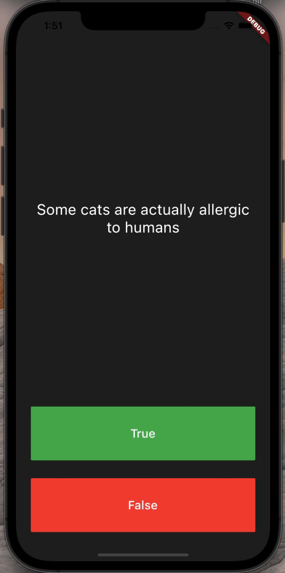

# Quizzler

## Goal
Object Oriented Programming (OOP) - Classes and Objects - exercise.

## The App
General knowledge quiz app.

## Features
- Object oriented application;
- Stateless and Stateful widgets;
